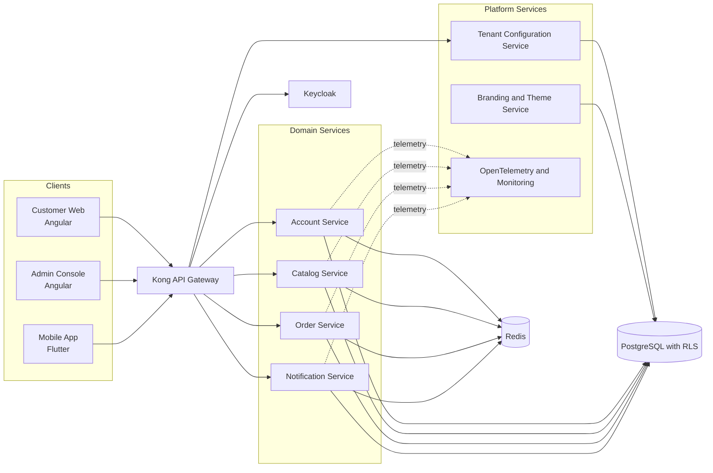
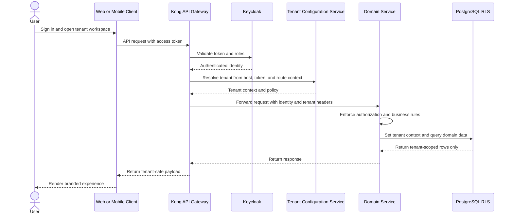

# ADR-0001: Adopt Modular Microservices With Tenant-Aware Platform Flows

## Status

Accepted

## Context

RFP-0002 approved the platform direction for a long-lived multitenant white-label product spanning
customer web, admin web, and mobile channels. That RFP selected Option 1, a modular microservice
architecture, but the engineering organization still needs one concrete decision record that makes
the initial structural boundaries, ingress path, and tenant-aware request flow explicit.

Without this ADR, teams can interpret "microservices" too broadly, introduce unnecessary service
proliferation, or implement tenant context inconsistently across clients, gateway policy, service
authorization, and database access. The first ADR must therefore convert the approved target
architecture into a governed platform shape that is simple enough to start, but strict enough to
preserve tenant safety and long-term modularity.

## Decision

The platform will be implemented as a controlled set of modular Java and Spring Boot microservices
grouped by business domain, fronted by Kong as the single API ingress layer, and integrated with
Keycloak for identity and access management.

Every request must carry an authenticated identity and resolved tenant context before reaching a
domain service. Each domain service remains responsible for business authorization, tenant-aware
validation, and database access constrained by PostgreSQL Row-Level Security. Shared platform
capabilities such as tenant configuration, branding, and observability remain separate from domain
business services.

The initial service landscape must stay disciplined. New services are created only when a business
domain, ownership boundary, or scaling characteristic justifies the split.

## Decision Drivers

- Preserve the approved Option 1 architecture from RFP-0002 without reopening the architecture style choice.
- Enforce tenant isolation consistently from ingress to persistence.
- Keep the initial platform modular without fragmenting the system into premature microservices.
- Support web, admin, and mobile channels through a shared API and policy model.
- Maintain cloud-agnostic, open-source-aligned operational choices.

## Options Considered

### Option 1: Modular Microservices With Explicit Platform Flows

- Decision status: Selected
- Description: Implement a small, governed set of domain microservices behind a single gateway and identity layer, with mandatory tenant context propagation and PostgreSQL RLS enforcement.
- Advantages: Clear domain ownership, explicit ingress and policy flow, strong tenant controls, and better alignment with the approved RFP.
- Disadvantages: Requires stronger operational discipline than a single deployable backend.

### Option 2: Modular Monolith With Later Extraction

- Decision status: Rejected
- Description: Start with one backend deployable and postpone service extraction until growth forces separation.
- Advantages: Lower operational overhead on day one and simpler local debugging.
- Disadvantages: Weakens the boundary discipline already approved in the RFP and increases the risk that tenant and authorization rules drift into inconsistent module-level conventions.

### Option 3: Tenant-Isolated Deployments From The Start

- Decision status: Rejected
- Description: Run a separate deployed stack per tenant from the first release.
- Advantages: Strong isolation and easier tenant-specific operational controls.
- Disadvantages: Adds cost and operational duplication too early, which conflicts with the approved shared-platform strategy.

## Rationale

Option 1 is the simplest architecture that still satisfies the approved platform goals. It keeps the
system modular at the business-domain level, preserves clean service ownership, and makes the
tenant-safety path explicit.

Option 2 was rejected because the approved RFP already chose a modular microservice direction for
long-term growth, and reverting to a monolith would weaken that decision at the exact point where
platform rules need to become concrete. Option 3 was rejected because strong isolation alone does
not justify the cost and operating burden for the initial release model.

## Diagrams

### High-Level Structure

### Primary Tenant-Aware Request Flow

## Request Flows

### Flow 1: Authentication And Tenant Resolution

1. A client authenticates through Keycloak and receives an access token.
2. The client sends the token to Kong together with the tenant-specific host or routing context.
3. Kong validates identity, resolves tenant context, and forwards only normalized identity and
   tenant metadata to downstream services.

### Flow 2: Domain Request Execution

1. A domain service receives the request after gateway policy checks.
2. The service applies business authorization using the authenticated user identity and tenant
   scope.
3. The service queries PostgreSQL only with tenant context bound to the session so Row-Level
   Security remains active for every tenant-owned table.

### Flow 3: Configuration-Driven White-Label Rendering

1. Client applications obtain tenant branding and configuration through platform services.
2. Brand assets, enabled features, and tenant policies remain configuration-driven rather than
   hardcoded in channel-specific clients.
3. The same core business services are reused across tenants while presentation and feature flags
   vary by configuration.

## Consequences

### Positive

- The approved RFP now has one executable architecture decision for service boundaries and request handling.
- Tenant-aware flow rules are explicit across gateway, identity, services, and database access.
- Web, admin, and mobile channels share one consistent API and authorization model.
- The platform can scale by domain while still limiting premature service proliferation.

### Negative

- Platform engineering effort is required early for gateway policy, identity integration, and service templates.
- Local development and debugging are more complex than in a single deployable backend.
- Teams must maintain stronger contract discipline between services from the start.

### Risks And Mitigations

- Risk: Too many services are created before domain boundaries are stable.
  - Mitigation: New services require architecture review and explicit domain, ownership, or scaling justification.
- Risk: Tenant context becomes inconsistent between gateway headers and service persistence logic.
  - Mitigation: Standardize tenant context propagation, test it in shared integration suites, and enforce PostgreSQL RLS for tenant-owned data.
- Risk: Shared platform services become a hidden monolith.
  - Mitigation: Keep tenant configuration, branding, identity, and observability responsibilities explicit and separately owned.

## Architecture Impact

- Affected domains or modules: gateway and edge policy, identity and access, tenant configuration, branding, domain business services, persistence, and observability.
- Responsibilities introduced or changed: Kong becomes the mandatory ingress layer; domain services own business logic; platform services own cross-cutting capabilities.
- Interfaces or contracts affected: external API routing contracts, tenant context headers, service-to-database access rules, and identity claims consumed by services.
- Testability impact: integration tests must verify token validation, tenant resolution, authorization, and RLS-protected data access.
- Decoupling impact: clients, gateway policy, shared platform services, and domain services remain separated by explicit contracts.
- Performance or scalability impact: domain services can scale independently, while Redis reduces repeated reads for hot paths and tenant configuration access.
- Cloud-agnostic considerations: Kong, Keycloak, Spring Boot, PostgreSQL, Redis, and observability tooling remain portable across providers.

## Related Artifacts

- Related RFPs: [RFP-0001](../../RFP/deliverables/RFP-0001-multitenant-white-label-platform.md)
- Related ADRs: None.
- Related diagrams: Mermaid diagrams embedded in this ADR.
- Related release manifests: None.

## Validation And Review Evidence

- Review file: [ADR-0001 Review](../../reviews/ADR/ADR-0001-modular-microservice-platform-review.md)
- Review status: Created for architecture and security review
- Validation checks performed: Repository-local editor validation and Mermaid syntax validation for embedded diagrams.
- Open validation items: Human confirmation of the initial service set, gateway policy standards, and tenant context propagation rules.

## Follow-Up Actions

- Create ADRs for tenant header standards, service decomposition rules, and event-driven messaging introduction criteria.
- Create diagrams for internal service-to-service interaction patterns if asynchronous flows are introduced.
- Add implementation checklists for gateway configuration, Keycloak claims mapping, and PostgreSQL RLS test coverage.